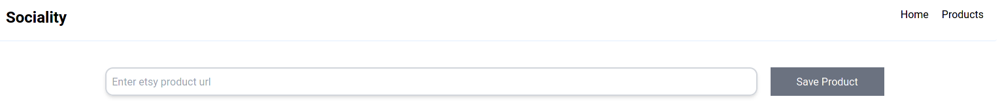

# Scraping Full Stack Project :pick:

A full stack project that makes scraping product from [Etsy.com](https://www.etsy.com).

## Technologies that i used

Backend | Frontend | Database
------------ | ------------- | -------------
Django| React JS| Postgresql

## How to try

1. Clone this repository.
2. Go to repository's folder with terminal.
3. Execute `docker-compose up --build` from terminal.
    > Make sure docker and docker-compose have installed in your system
4. When the messages in your terminal done just go to http://localhost:3001
4. Thats it! You are done.

## Endpoint URLS

Backend | Frontend
------------ | -------------
http://localhost:8003| http://localhost:3001
